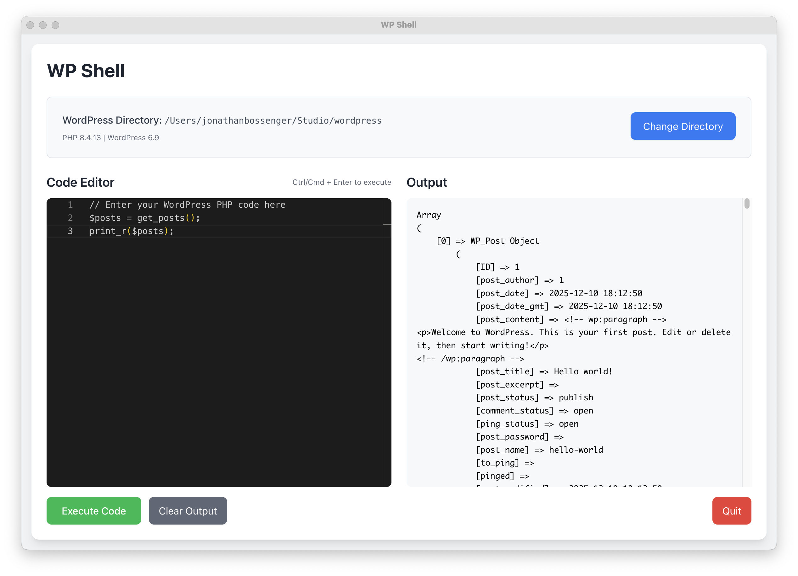

# WP Shell


A companion app to [WP Debug](https://github.com/jonathanbossenger/wp-debug) that lets you connect to a local WordPress installation and execute any WordPress PHP code directly from a desktop application.



## Features

- **Connect to WordPress**: Select your local WordPress installation directory
- **Execute PHP Code**: Run any WordPress PHP code in the WordPress context
- **View Output**: See the results of your code execution in real-time
- **Enhanced IntelliSense**: Version-aware autocomplete for 5,000+ PHP and WordPress functions
  - Automatic PHP version detection (7.4-8.3)
  - Automatic WordPress version detection (6.0-6.5)
  - Smart caching for instant subsequent loads
  - Function signatures and documentation on hover
- **Code Editor**: Monaco Editor with syntax highlighting and keyboard shortcuts
- **Recent Directories**: Quick access to recently used WordPress installations

## Installation

### From Source

1. Clone the repository
2. Install dependencies:
   ```bash
   npm install
   ```
3. Run in development mode:
   ```bash
   npm run dev
   ```

### Building

To build the application:

```bash
npm run build
npm run make
```

## Usage

1. Launch the application
2. Select your WordPress installation directory
3. Write your PHP code in the editor
4. Press `Ctrl/Cmd + Enter` or click "Execute Code" to run your code
5. View the output in the output panel

## Requirements

- PHP must be installed and available in your system PATH
- A local WordPress installation

## Technology Stack

- Electron
- React
- Tailwind CSS
- Node.js

## License

GPL-2.0-or-later
